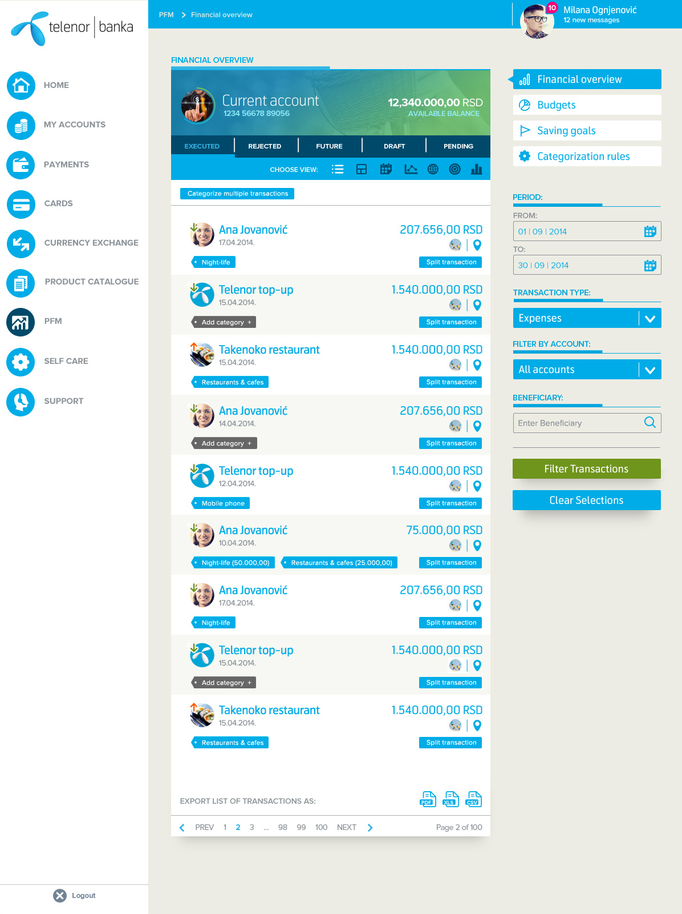
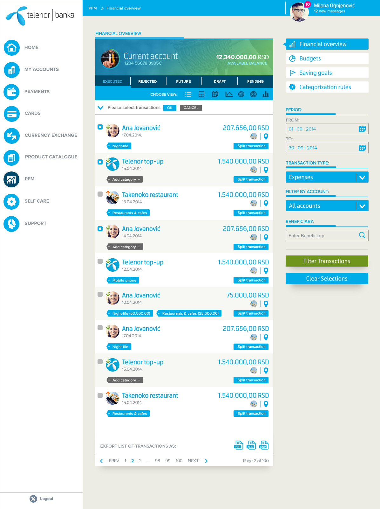
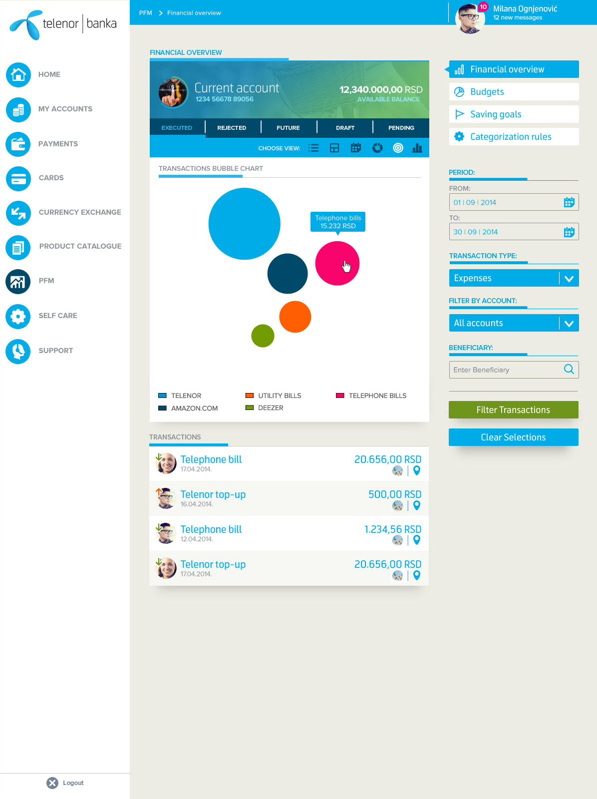

Personal Finance Management
===========================
Personal Finance Management is a set of activities performed by the customer on its financial data for the purpose of getting clear picture of the incomes/expenses trends, as well as enabling customer to manage monthly budget and personal financial goals.

Personal Finance Management starts with **categorization** of transactions into income, expense and savings & investment categories and subcategories. Majority of transactions should be automatically categorized, allowing the customer to manage categorization manually and using user categorization rules. Each transaction has a category and optionally a subcategory assigned. Categorization scheme used within the solution is described below. 

Note that besides spending categories, categories enum includes values for uncatogorized and split transactions.


PFM Frontend
============
PFM frontend is a single-page application written in Angular

Basic Features 5MD
--------------

### FE-B1 List transactions (1 points)

Present a list of transactions for categorization.
For each of transactions in the list present following information:
- Transaction id
- Beneficiary name
- Transaction date
- Direction (credit or debit represented as red/green arrow icon)
- Transaction amount
- Transaction currency
- Transaction kind
- Split marker (whether transaction is a split of another transaction)
- Category (PFM category of categorized transactions)
> Note that:
> - Transaction list should be filtered by account.
> - Transaction list should be sorted by date (descending) and category (ascending).





### FE-B2 Categorize a single transaction (1 points)
Offer option to set or change the category of transaction.
- Display drop-downs with the list of all possible PFM categories
- Display drop-downs with the list of all possible PFM subcategories filtered by category dropdown value
- Previously set category and subcategory are preselected in the dropdowns
- user can optionally select the subcategory from the list
- upon succesfull categorization (click on Apply button), category of transaction is persisted to database via API call
- newly set category is presented on the transaction list screen


### FE-B3 Categorize multiple selected transactions (1 points)
Offer option to set or change the category of selected transactions.
- Display a button to categorize multiple transactions
- When button is clicked show a selection checkbox for each transaction
- Offer buttons to proceed with categorization or cancel selection
- When user clicks OK to proceed with categorization:
  - Display drop-downs with the list of all possible PFM categories
  - Display drop-downs with the list of all possible PFM subcategories filtered by category dropdown value
  - user can optionally select the subcategory from the list
- upon succesfull categorization (click on Apply button), categories of transactions are persisted to database via API call
- newly set categories are presented on the transaction list screen


### FE-B4 Split transaction (2 points)
Offer option to "split transaction" from the list of transactions into multiple transactions each having a specific category and amount.
- Display two splits initialy, offer option to add additional splits
- For each split:
  - Display drop-downs with the list of all possible PFM categories
  - Display drop-downs with the list of all possible PFM subcategories filtered by category dropdown value
  - Display an input for split transaction amount
  - user can optionally select the subcategory from the list
- upon succesfull split (click on Apply button), splits are persisted via API call
- newly added splits are presented on the transaction list screen
Not that:
- Sum of amounts from split transactions must be equal to amount of original transaction.
- New transactions (resulting from split) are recorded with same attributes as the original transaction apart from category, amount and split marker.


Extra credit features (5 points)
-----------------
### FE-A1 Present spending by category with tree map chart (1 point)
Tree map view is the chart that provides data tree in form of rectangles of various colours and sizes. Each rectangle displays information on name of category and spent amount. Size of rectangle is directly proportional to the sum value of spending transactions for the category. Only top level categories are displayed initially.
- When user clicks on a category rectangle:
  - Tree map view of subcategories related to the category is displayed
Note that:
- Chart displays information for current month but user can specify other date period


Additional ideas





### FE-A2 Responsive UI (2 points)
Make user interface adaptable to mobile and desktop form factor (screen width).
- All functionality must work with touch / on-screen keyboard input on mobile
- All functionality must work with mouse / keyboard input on desktop

### FE-A3 Backend simulation with sandbox in Node and Redis (2 points)
Create Node.js app using sandbox kit generator from ASEE.
Setup Redis Docker container on your machine and configure sandbox to use Redis instance as data store.
Simulate API calls according to PFM API OAS3 specification by persisting data to Redis.
Seed data from pfm-transactions.csv file.

### FE-A4 Write UI tests (2 points)
Pick a UI testing tool of you choice such as Selenium, Taiko, Puppeteer or other.
Write automated tests for A2 Categorize single transaction and A4 Split transaction requirements.

### FE-A5 Make your frontend interoperable (2 points)
Collaborate with a colleague to make your frontend work with his/her implementation of backend.
Fix any integration issues.


Above and beyond
-----------------
- Implement additional visualisations of spending by category (donut chart, pie chart, bar chart)
- Make UI visually as close as possible to designer mocks
- Be creative, surprise us!


Assumptions
------------
- You will create a Prism mock of PFM API to simulate backend calls and data.

PFM Backend
====================================
PFM microservice written in .Net core

Basic Features
--------------

### BE-B1 Import transactions from csv file  (1 points)

- Enable import of bank transactions based on the format of bank_transactions.csv file.
- Expose POST /transactions/import API endpoint for this purpose.
- Create relational DB schema to support import of transactions with `id` as primary key.
- Validate input according to OAS3 spec.
- Persist transaction into database.

### BE-B2 List transactions with filters and pagination (0.5 points)

- Enable paginated listing of transactions based on supplied filter conditions.
- Expose GET /transactions API endpoints for this purpose.
- Implement period filter (start-date and end-date).
- Implement transaction kinds filter as a list of acceptable transaction kinds.

### BE-B3 Import categories from csv file (1 points)

- Enable import of spending categories based on the format of categories.csv file.
- Expose POST /categories/import API endpoint for this purpose.
- Create relational DB schema to support import of categories with `code` as primary key and foreign key from transactions to categories on `catcode` matching `code` field.
- Validate input according to OAS3 spec.
- Persist categories into database.

**Note that:**
- when `code` already exists its name should be updated
- `parent-code` already exists it should be updated

### BE-B4 Categorize single transaction (0.5 points)

- Enable categorization of a single transaction.
- Expose POST /transactions/{id}/categorize endpoint for this purpose.
- Validate that both category and transaction exists in database.
- Persist newly set category in database.

### BE-B5 Analytical view of spending by categories and subcategories (1 points)

- Enable analytical views of spendings by categories and subcategories.
- Expose GET /spending-analytics endpoint for this purpose.
- Implement optional category filter.
- Implement optional period filter (start-date and end-date).
- Implement optional direction filter (debits or credits)

### BE-B6 Split transaction (1 points)

- Enable split of transaction into multiple spending categories or subcategories.
- Expose POST /transactions/{id}/split endpoint for this purpose.
- If transaction is already split, deleta existing splits and replace them with new ones.
- Validate that the transaction and categories exist.
- Create relational DB schema that can persist splits for a transaction.
- Extend transaction list endpoint to return splits for each transaction.
- Persist splits into database with `amount` and `catcode`.


Advanced features
-----------------
### BE-A1 Write API tests in Postman (2 points)

- Write test cases that cover basic requirements with API tests written in Postman tool.
- In test assertions validate at least status code and schema of response payload.
- Create test report in HTML using newman html-reporter.

### BE-A2 Automatically assign categories based on predefined rules (2 points)

- Enable automatic assignment of categories and subcategories based on predefined rules.
- Expose POST /transactions/auto-categorize endpoint for this purpose.
- Define rules to correctly categorize at least 50% of transactions. Hint: some transactions occur more frequently than others.
- If transaction already has a category assigned do not reasign it to automaticaly determined category.
- Each rule has a code of categery and SQL compliant predicate expression (filter condition) that defines which transactions should fall into the category.
- Make rules configurable (outside of your code) in a config file.

**Examples of rules:**

```yaml
rule-1:
  title: When beneficiary name contains "chevron" or "shell" categorize transaction as 4 (Auto & Transport / Gas & Fuel)
  catcode: 4
  predicate: beneficiary-name LIKE '%chevron%' OR beneficiary-name LIKE '%shell%'
rule-2:
  title: When mcc is 5811 (Caterers) categorize transaction as 39 (Food & Dining / Restaurants)
  catcode: 39
  predicate: mcc = 5811
```

### BE-A3 Create a basic web UI for transaction list and categorization of single transaction (2 points)

- Make a functional web UI in technology of your choosing (plain JS+HTML, ASP.NET, Angular, React, etc).
- Design is not important as long as it works.
- See requirements FE-B1 and FE-B2 for details.


### BE-A4 Make your backend interoperable (2 points)

- Collaborate with a colleague to make your backend work with his/her implementation of frontend.
- Fix any integration issues.


Above and beyond
----------------
- Implement more UI
- Define and implement additional API endpoints for configuring auto categorization rules 
- Create load test with JMeter to analyze how average response time corresponds to an increasing load (calls per second)
- Be creative. Surprise us!

Assumptions
-----------
- APIs you expose will conform to PFM API specifications


