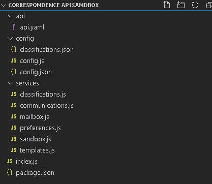

# Sandbox Kit Generator tool
Sandbox Kit Generator is a dotnet global tool which is a part of API Kit that allows you to generate application skeleton for writting sandbox applications in NodeJS using YAML or JSON file containing API definition written in [OpenAPI](https://github.com/OAI/OpenAPI-Specification/blob/master/versions/3.0.0.md) specification. Generated code uses [ExpressJS](https://expressjs.com/) package for running web server and [openapi-backend](https://github.com/anttiviljami/openapi-backend) package for routing and request and response validation.

## Installing Sandbox Kit Generator tool

In order to install and run the Sandbox Kit Generator tool, you need to have .NET Core 3.1 runtime installed on your local machine. .NET Core 3.1 SDK and Runtime can be downloaded [here](https://dotnet.microsoft.com/download/dotnet-core/3.1).

If you have .NET Core installed on your machine, verify that you have required version of it by running `dotnet --version` from CLI.

Test Coverage Tool can be installed from CLI using `dotnet tool install` command. This command will download the tool from NuGet repository and install it on your machine. 

To install Test Coverage Tool run following command:

```
dotnet tool install  Asseco.Tools.APISandboxGenerator  --global
```
To verify that tool was installed successfully, run:
```
sandboxgen --version
```

## Usage

### Name

`sandboxgen` - Runs the Sandbox Kit Generator tool

### Synopsis

`sandboxgen <SPECIFICATION>`
  
`sandboxgen --version`
  
`sandboxgen --help`

### Arguments

`SPECIFICATION`
  
Input specification file to be processed. [OpenAPI](https://github.com/OAI/OpenAPI-Specification/blob/master/versions/3.0.0.md) specification in JSON or YAML format.

## Using the generated code
After the successful generaton of the API with the Sandbox Kit Generator generated code can be found in the folder in which tool was run. In this folder will appear a new folder called GeneratedCode. In this folder there will be a folder for each generated API. Open the folder with generated code in editor (ex. Visual Studio Code).

### Required tools
In order to develop, build, run and debug the generated sandbox applications we recommend following tools: 

1. [Visual Studio Code](https://code.visualstudio.com/)

2. [NodeJS](https://nodejs.org/en/download/)

3. [Docker](https://www.docker.com/)

### Generated output
After the generator output is opened in the code editor, you should get project structure that looks similar to this, depending on which API was generated.



- `api/api.yaml` contains the OpenAPI definition of the API for which the code is generated. This file is used by the `openapi-backend` application for request routing and request validation.
- `config` is the folder that contains application configuration
    - `classifications.json` this is the file that contains list of all classification schemas and classification values that were extracted from API definition. This configuration is used in order to retrieve classification data on `/classifications` and `/classifications/{schema-id}` endpoints.
    - `config.json` this is the file that contains JSON object which is used for configuring the application.
    - `config.js` contains the configuration provider which provides appropriate configuration depnding on the environment on which is application run
- `services` contains generated services for each operation group that was found in the API definition. Operation groups are distinguished by the TAG property. These files are containing stub functions for each API operation. These stubs are returning mock responses by default.
- `index.js` the application entry point.
- `packages.json` list of packages that are used in the application

### Configuring the sandbox application
The application can be configured through the `config.json` file. The configurations that can be configured through the configuration file are:

- `database` - inside this section we can configure connection to database, this configuration will be used only if application is run in development mode. Otherwise configured environment variables will be used in order to retrieve database configuration. The list of these enviromnent variables can be found in `config.js` file under the configuration provider. 

- `customerIdRequired` - if this boolean field is set to true, authorization middleware will require sending of `X-Customer-ID` header to all endpoints except to the endpoinds located in `sandbox` service and endpoints located in `classification` service. This header must contain a value that represents customer ID of a customer that was created on `/sandbox/create` method.

- `webHooks` - configuration section for configuring webhooks
    - `eventTopic` - Identificator of a topic on which webhook service should listen for API events that should be sent to the webhook subscribers
    - `requestOrigin` - Origin value that will be sent in `WebHook-Request-Origin` header in `OPTIONS` request on `POST /webhook` method in order to validate webhook delivery URL
    - `enableDeliveryUrlValidation` - if set to false, this config will disable delivery URL validation on webhook registration 
- `logging` - configuration section for configuring logger

### Debugging and running the application
In order for application to work we need a functional redis instance. If we don't have one, we can run it on our local docker instance by running this command:
```
docker run --name sandbox-redis -p 6379:6379 -d redis
```
This command will run redis in Docker container on port 6379.
Before running the application we need to install application dependencies required for application to work. 
To do this, follow the steps below:

- download **node-microservice-chassis-0.0.1-20.dev.20210810.1.sha-81fad6.tgz** from https://github.com/assecosee/pfm/blob/main/node-microservice-chassis-0.0.1-20.dev.20210810.1.sha-81fad6.tgz
- put **node-microservice-chassis-0.0.1-20.dev.20210810.1.sha-81fad6.tgz** file in the root of your application folder
- open the application folder in VS Code
- change `@asseco/node-microservice-chassis` dependency in package.json to install package from a file
```json
{
    "dependencies":{
        ...
        "@asseco/node-microservice-chassis": "file:node-microservice-chassis-0.0.1-20.dev.20210810.1.sha-81fad6.tgz"
        ...
    }
}
``` 
- inside VS Code terminal run
```bash
npm install
``` 

> This command will install all required dependencies. If there is a problem with installing any package please contact your mentor.

After the successful installation of all dependencies, application can be run with following command
```
npm run start
```
Application can be also run by clicking on Run and then on `Start Without Debugging`. If there is a promt to select environment, select `Node.js`. Each sandbox application will by default listen on the default port that is configured in servers section in API definition.

In order to debug the application open the terminal and click on the dropdown for switching between terminals and click on `Create JavaScript Debug Terminal` like on image below:

In this terminal run the following command in order to start debugging:
```
npm run start
```
The application can be also run in debug mode by clicing on Run and then on `Start Debugging`. If there is a promt to select environment, select `Node.js`.

### Witting handlers for API operations
As mentioned before, for each API operation generator will generate an handler which returns demo response. Each handler accepts three parameters:

1. `c` - request context provided by openapi-backend package which contains complete request data with validation information and OAS3 schema informations

2. `req` - request context provided by the ExpressJS package

3. `res` - response context provided by the ExpressJS package

Application configuration imported from `config.json` file can be referenced in services with following command:
```js
global.gConfig
```

For example if we want to access the Redis configuration we would type this:
```js
global.gConfig.redis.redisHost
```

### Writting methods for creating and resetting sandbox data
On top of the operations that are found in the API definition, the Sandbox Kit Generator will generate one more service called `sandbox`. This service can be found in `services/sandbox.js` file and it contains two methods:

1. Create method that should be used for generating sandbox data (located on `/sandbox/create`)

2. Reset method that should be used for resetting created sandbox data to the initial state (located on `/sandbox/reset`)/

These two methods should be implemented in a such way that each generated sandbox is isolated from the others. As a result caller will get JSON object containing the information required for invoking other sandbox methods. One of the parameters that should be returned in the response is the ID of the generated sandbox which should be unique GUID or UUID. This ID should be provided to all calls to the sandbox through the header parameter `X-Sandbox-ID`
For an example of how should these methods be implemented go to the [Account Data API Sandbox](https://github.com/asseco-see/api-sandbox/tree/main/account-data).

### Logging
Besides standard logging using `console.log()` generated applications support logging using [structured-log]() library. This logger is accessable on a global level and it can be accessed in a following way:
```js
global.log.info("This is example logging");
``` 

Log level can be configured through the `config.json` configuration file.

## Sandbox Kit npm package
Generated sandboxs application contains a reference to the `@asseco-see/sandbox-kit` npm package. This package provides middlewares, utilities and clients for generating seed data, database access, publising and subscribing to events etc.

### StorageClient
Sandbox applications by default use Redis as a NoSQL data storage. Package `@asseco-see/sandbox-kit` contains `StorageClient` which is a wrapper around NodeJS Redis client. The `StorageClient` provides interface for data manipulation and publishing and subscribing to events that is aligned with [DaprJS SDK](https://github.com/dapr/js-sdk). Besides this interface, the client contains wrapper methods that allow the consumer to easily store and read JSON objects from the Redis. These methods are:

1. `setObject(key, jsonObject)` - method that accepts string as a database key and a JSON object as a value that should be stored in database. This JSON object will be serialized to string and stored as a string in Redis

2. `getObject(key)` - method that accepts string as a database key and returns JSON object retrieved from the database

3. `del(key)` - method that accepts string as a database key and deletes object stored under the provided key from database

`StorageClient` can be imported and instantiated in NodeJS module like this:
```js
const sandboxKit = require('@asseco-see/sandbox-kit');
//...
var client = new sandboxKit.StorageClient(global.gConfig.database.host, global.gConfig.database.port, global.gConfig.database.catalogName, global.gConfig.database.password);
```

### PubSubClient
In case when one sandbox application has to listen to the events published by another application, we need to use the events. For this, `@asseco-see/sandbox-kit` package provides the `PubSubClient`. The `PubSubClient` can be used for both publishing events and for subscribing to the events. The `PubSubClient` provides two methods:

1. `publishEvent(publishEventRequest)` - async method that accetps object of type `sandboxKit.pubsub.messages.PublishEventRequest` and publishes event to the specified topic

2. `onTopicEvent(topicEventRequest)` - method that accepts object of type `sandboxKit.pubsub.messages.TopicEventRequest` and subscribes to the specified topic  

#### Publishing events
In order to publish event to message broker, you need to create and populate the object of the type `sandboxKit.pubsub.messages.PublishEventRequest`. `PublishEventRequesst` contains two fields:

1. `topic` - topic on which you want to publish event, this field is accessable through the getter and setter methods `getTopic()` and `setTopic(topic)`

2. `data` - event payload which you want to publish to specified topic, this field is also accessable through the getter and setter methods `getData()` and `setData(data)` 

Publishing events requires instance of `PubSubClient`. The client can be created and used in the following way:
```js
//...
const pubsubClient = new sandboxKit.PubSubClient(
    global.gConfig.database.host, 
    global.gConfig.database.port, 
    global.gConfig.database.catalogName, 
    global.gConfig.database.password);
const event = new sandboxKit.pubsub.messages.PublishEventRequest();
event.setTopic("api-name/example-api-event");
event.setData(JSON.stringify(eventData));
await pubsubClient.publishEvent(event);
//...
```

#### Subscribing to the events
In order to publish event to message broker, you need to create and populate the object of the type `sandboxKit.pubsub.messages.TopicEventRequest`. The `TopicEventRequest` class contains two fields:

1. `topic` - topic on which you want to listen to the events, this field is accessable through the getter and setter methods `getTopic()` and `setTopic(topic)`

2. `cb` - the callback method which should be invoked when an event is received on specified topic. This field is accessable through the getter and setter methods `getCb()` and `setCb(cb)`. The callback method will be invoked with two arguments: 

    - `channel` - string parameter which holds the value that represents the name of the topic on which the event was received
    
    - `message` - string representation of JSON object that holds event payload

Subscribing to the events requires instance of `PubSubClient`. The client can be created and used in the following way:
```js
//...
const subscriber = new sandboxKit.PubSubClient(
    global.gConfig.database.host, 
    global.gConfig.database.port);
const topicEvent = new sandboxKit.pubsub.messages.TopicEventRequest(); 
topicEvent.setTopic("payapi-name/example-api-eventted");
topicEvent.setCb((channel, message) => {
  console.log(`${channel}:${message}`);
});
subscriber.onTopicEvent(topicEvent);
//...
```

### Webhooks and classifications
If API definitions contains operations for working with Web Hooks or Classifications, handlers for these methods will be generated automatically. By default the Webhooks service will run with the application. This application will listen to the Redis topic which name is located in `config.json` file under the name `webHooks.eventsTopic`. Whenever there is an event published on this topic, webhooks service will send this event to all registered webhook subscribers. Published event must have all fields that are required by CloudEvents specification. In addition to this, this event has to have `source` field in following format `{sandboxId}:{eventSource}`. This is because registered webhooks are isolated in each created sandbox and therefore, event body must contain information for which sandbox is it published. 

### Fault simulation
If there is a need to simulate a system fault, sandbox application are providing this through `Fault Simulation` middleware. This middleware is invoked if there is a `Prefer` header in the request. The `Prefer` should be in the on of the following formats:

- `code:{problemCode}` - where problemCode is code of the API specific problem or common validation problem. List of this codes and their payloads can be found in `config/config.json` file under the `faultCodes` section;
- `code:{statusCode}` - where statusCode is integer representation of HTTP status code that you want to invoke manually.

### Authorization
The `@asseco-see/sandbox-kit` npm package comes with a simple authorization middleware. This middleware is by default included in the generated sandbox applications. The middleware is checking for existence and validity of two headers: `X-Sandbox-ID` and `X-Customer-ID`. 

The value of the `X-Sandbox-ID` header is expected to be the ID of the sandbox that was previously created on `/sandbox/create` endpoint. If this header is not provided or if it contains the ID of non-existent sandbox, the `404 Not Found` HTTP status code will be returned. This header is required on all endpoints except on `/sandbox/create` endpoint.

The value of the `X-Sandbox-ID` header is expected to contain the `Customer Number` of the previously created customer on the `/sandbox/create` method. By default this header is not required and it's value will not be validated. This can be changed by changing the value of the field `customerIdRequired` in the `config/config.json` file to `true`. If the validation of the `X-Customer-ID` header is turned on, validation will be applied on all endpoints except on endpoints for creating and resetting the sandbox, endpoints for fetching classifications and webhooks endpoints.

## Creating data seed for the new API Sandbox
Each API sandbox comes with a methods for creating and resetting sandbox data. Because most of the Asseco APIs are dependent on data from other APIs, created data needs to be syncronized between all sandbox applications on one environment. Because sandbox applications should be implemented in a way that there are no direct calls between the sandboxes, we need an additional service that will generate initial data seed for all sandbox applications, and that will send this seed to each sandbox application in order to generate data. In this way, all APIs will have same resource IDs and therefore if any sandbox application has to access the data that was created by another sandbox application, it can be sure that resource IDs are same in both applications. 

Service responsible for creating inital data seed is called `sandbox` and it can be found in the [api-sandbox](https://github.com/asseco-see/api-sandbox/tree/main/sandbox) GitHub repository. As other sandbox applications, the `sandbox` service exposes two endpoints `/sandbox/create` and `/sandbox/reset`.

The `POST /sandbox/create` endpoint expects object in the request body that has following schema
```json
{
  "$schema": "http://json-schema.org/draft-04/schema#",
  "type": "object",
  "properties": {
    "sandboxId": {
      "type": "string"
    },
    "apis": {
      "type": "array",
      "items": [
        {
          "type": "string"
        }
      ]
    }
  },
  "required": [
    "sandboxId",
    "apis"
  ]
}
```
The `sandboxId` property should be obtained after the registration on the Developer Portal application. 

The `apis` property represents the array of API names for which you want to generate sandbox data. 

Here is an example of the request for creating sandbox data:
```json
{
    "sandboxId": "digital-platform",
    "apis": [
        "account-data",
        "arrangements",
        "payment"
    ]
}
``` 

Request with the JSON object above in payload will create sandbox with the ID `digital-platform` for `account-data`, `arrangements` and `payment` APIs.

### Adding data seed
Data seed for each supported API/API resource is located in `seed` folder. Root object for data seed is located in `sandbox-seed.json` file. This object contains two fields:

- `sandbox` - JSON object that contains sandbox level configuration (ex. sandbox currency or sandbox localization)

- `customers` - JSON array that contains a list of customers that will be generated on sandbox creation.

Here is an example of the customer object:
```json
{
            "name" : "Ana Stojadinovic",
            "location": "Janka Veselinovica 23, 34000 Kragujevac, Republika Srbija",
            "age": 18,
            "customerNumber": "{generated}",
            "sandboxData" : {
                "accountData": {
                    "$ref" : "./seed/accounts-seed.json#/1"
                },
                "arrangement": {
                    "$ref" : "./seed/accounts-seed.json#/1"
                }
            }
        }
```

Data seed is splitted in multiple JSON files which are merged in single JSON object using JSON references before sending to the sandbox applications. In the example above we can see that customer object has `sandboxData` property which should contain seed data for this customer for each of the supported API sandboxes. The seed for each of the sandbox applications should be referenced by using the local file JSON references. 

In this example, `accountData` and `arrangement` APIs seeds share the same `accounts-seed.json` file in order to synchronize account numbers in these two APIs. Here is an example of reference JSON object in `accounts-seed.json` file:
```json
"1" : [
        {
            "kind": "current-account",
            "accountNumber" : "faker({{finance.accountNumber}})",
            "iban": "faker({{finance.iban}})",
            "balances": [
                {
                    "kind" : "available",
                    "amount": 0,
                    "amountLocal": 0
                }
            ],
            "transactions": {
                "$ref": "./transactions-seed.json#/1.1"
            },
            "statements": {
                "$ref": "./statements-seed.json#/1.1"
            }
        },
        {
            "kind": "current-account",
            "accountNumber" : "faker({{finance.accountNumber}})",
            "iban": "faker({{finance.iban}})",
            "balances": [
                {
                    "kind" : "available",
                    "amount": 0,
                    "amountLocal": 0
                }
            ],
            "transactions" : {
                "$ref": "./transactions-seed.json#/1.2"
            },
            "statements": {
                "$ref": "./statements-seed.json#/1.2"
            }
        }
    ],
```   

In the examles above, we can see a few non standard field values like `faker({{finance.accountNumber}})` and `{generated}`. These values are `template field values`. There are two kinds of the `template field values`: `declarative template field values` and `template field action values`. 

`Declarative template field values` are used for specifing from which shource should the field value be populated. 

`Template field action values` will trigger the action specified in the field value once the loaded JSON object from template has been evaluated. 

Template field action values can be evaluated by calling the function `sandboxKit.utilities.evaluateTemplateActionFieldValues`. This function accepts two arguments:

1. JSON object to be evaluated;

2. Name of the localization which should be used for field evaluation (for the list of the supported localizations visit [FakerJS](https://github.com/marak/Faker.js/)).

Template field values are:

- `faker({{fakerFunction}})` - This is the template field action value. If the field in the JSON seed has a value in this format, than the value of this field will be evaluated using FakerJS library. This is useful when we need to populate a field with a random value (ex. random customer name, iban, account number, transaction description etd.). For the list of faker functions that can be used visit [FakerJS](https://github.com/marak/Faker.js/) GitHub repository. 

- `{generated}` - This is declarative template field value. It is declarative value which is saying that value of this field should be generated and provided by the developer in the code.

- `{seed}` - This is declarative template field value. It is declarative value which is saying that this field was previously generated in data seed and that it should be reused from the seed.

### Adding custom logic for generating field values in the seed
The code which is responsible for replacing fields that have `{generated}` or `{seed}` values is located in `services/sandbox.js` file. In this file is located `SandboxService` responsible for seed generation and for passing the seed to the sandbox applications. All custom logic for data generation should e placed in the `fillCustomerData` method of the `SandboxService`. 
